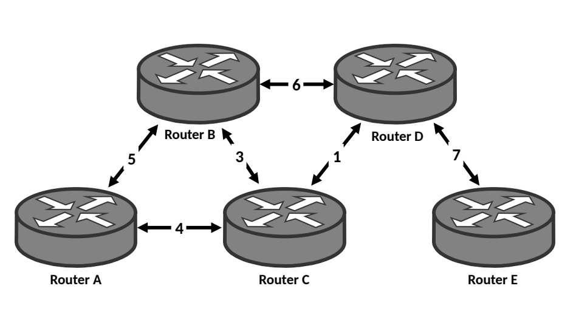
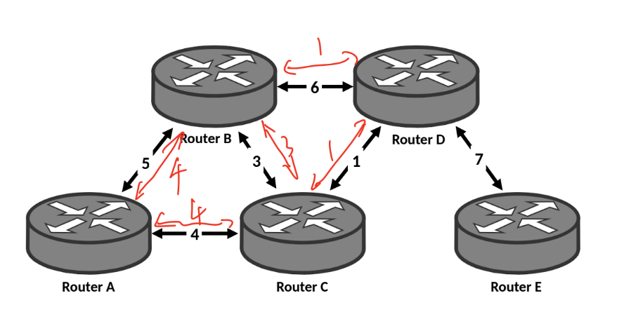

# HW1

## Question 1: Delays

For this part, consider two hosts, A and B, connected by a switch S. The link A↔S is 80 Mbps
and has a propagation delay of 8 ms; the link B↔S is 16 Mbps and has a propagation delay
of 80 ms. Assume 1 byte = 8 bit and 1k=1000 (not 1024). Also assume 1s=1000ms.

1.  Suppose A sends a 100 kB packet to B. What is the total (end-to-end) delay before the
packet is received by B in its entirety? Assume that S operates in a “store-and-forward”
manner and that the processing delay is 0.

    *Answer*: 
    
    TotalBits = 100kB = 100 * 1000 * 8 = 8e5 b
    
    From A to S, transmission delay = 8e5 b / 80Mbps = 1e-2 s = 10ms, propagation delay = 8ms

    From S to B, transmission delay = 8e5 b / 16Mbps = 5e-2 s = 50ms, propagation delay = 80ms

    Total delay = 10ms + 8ms + 50ms + 80ms = **148ms**

2. Suppose A is sending a sequence of 100 kB packets. How many packets will it have sent when the first packet arrives (completely) at B? (integer number of packets)

    *Answer*: 

    Total delay = 148ms

    Total transmission bits = 148ms * 80Mbps = 1.184e7 b

    Total transmission packets = 1.184e7 b / 100kB = 14.8

    So **14** packets have been sent.

3. Let S have a 900 kB buffer for packets. Suppose A sends a sequence of 100 kB packets as fast as possible; how long will it be until the buffer is full?

    *Answer*:

    Every second the inflow of buffer is 

    inflow = 80Mb

    and outflow = 16Mb.

    So increasing data per second, dps = 80Mb - 16Mb = 8MB = 8e6 Bytes

    Full time = 900kB / 8MB = **0.1125s**

    (if counting the time from the first bit sent from A, then we should add a propagation delay, full time = 0.1125s + 8ms = 0.1205s)

4. What will be the queueing delay encountered by the last packet to enter the buffer?

    *Answer*: 

    There are 900kB / 100kB = 9 packets in the buffer, so the last packet has to wait the first 8 packets transmitted from S. 

    Queueing delay = 8 * 100kB / 16Mbps = **400ms**

5. Assume now that the buffer is infinite and each packet size is 100 kB. How long will it take (end-to-end) for a 100 MB file to be sent from A to B? What is the average throughput?
   
    *Answer*:

    From the formula,

    $$ Throughput = min(R_{as}, R_{bs}) $$

    where $ R_{as} $ and $ R_{bs} $ is the rate of pipe that can carry bits (bps).

    So the total time = 100MB / 16Bbps = **50s**

    (If more accurate, total should count the propagation delay of first packet from S to B and from A to S, and count the transmission delay of first packet from A to S, which is 10ms + 8ms + 80ms = 98ms, so the final result = 50.098s)

    Average thoughput = **16Bps**

6. Suppose that, after B receives a packet, it sends a short (100 byte) acknowledgment
packet to A. A waits for this acknowledgment before sending the next packet. How
long will it take to send a 100 MB file in this setting? What is the average throughput?

    *Answer*:

    Time for one packet = time_packet + time_acknowledgement = 148ms + 148ms / 1k = 148.148ms, (because acknowledge is 1000 times smaller as one packet)

    Total packets = 100MB / 100kB = 1000

    Total time = 148.148ms * 1000 = 148148ms = **148.148s**

## Question 2: Layering
Give a real-world example of a system / set of protocols that can be explained using layering.
Explain what the layers are (there should be at least 3), and what the interface between each
pair of adjacent layers looks like.

In the context of your example, what are some of the advantages of layering? What is a
disadvantage?

*Answer*:

Organization of train travel is a kind of layering.

Layer 1: Ticket system -- between customer and ticket system, and between ticket system. Ticket system get the ticket information from customers, and send the information to the particular train station.

Layer 2: Train station system -- between station and ticket system. Station get the information from ticket system, and will inform the customer which gate they should head to.

Layer 3: Train system -- between stations and trains. Station inform trains which gate they should stop and what time should they arrive, and would instruct the customer to take the train.

Layer 4: Routing system -- among several trains and stations. The system get the information that when and where the train should stop, and give the route that trains should follow.

Advantage: 
1. It can deal with complex systems.
2. It can ease the maintenance, updating of system. Even there is change of one layer, there would be little influence on the rest of the system.

Disadvantage: 
1. If one layer is broken down, the rest of the system cannot work. For example, if the ticket system cannot work, then the customer cannot buy the tickets, so the train system can't work anymore.
2. Information transmission between layers maybe slower than other systems.

## Question 3: Circuit Switching

The diagram below shows a network of routers and the capacity of links (in Mbps) that are
attached to each router.

1. If each circuit uses 1 Mbps, how many circuits can we simultaneously support between routers A and E? Which links would they use?

    *Answer*:

    

    As shown in the image, it can support 7 circuits.

    Links used in the circuits is also shown in the image.

2.  How many circuits can we simultaneously support between B and C? Which links
would they use? For this part, assume that no other circuits are active.

    *Answer*:

    

    As shown in the image, it can support 7 circuits.

    Links used in the circuits is also shown in the image.

3. For this part, consider establishing circuits simultaneously A↔D and B↔C. What is the maximum total number of circuits that this network configuration would support?

    *Answer*:

    

    As shown in the image, red arrows mean the links used by the circuits between A and D, blue arrows mean the links used by the curcuits between B and C. It can support at most 9 circuits simultaniously. 

## Question 4: Packet Switching

Suppose that you share your 600 Mbps connection with two roommates. The first roommate
uses the link 50% of the time, and the second one uses the link 50% of the time. Assume
that their internet access activity is independent from each other. Also assume that network
use is distributed uniformly through the day.

1. What is the fraction of the time that you have the connection all to yourself?

    *Answer*:

    At one particular time, the probability of both roommates not using the internet is 0.5 * 0.5 = 0.25

    So throughout the time, time of the internet belonging to yourself is 25% of the time. 

2. What is the fraction of the time that you have to share the connection with both
roommates simultaneously?

    *Answer*:

    At one particular time, the probability of both roommates using the internet is 0.5 * 0.5 = 0.25

    So throughout the time, time of the internet shared with other roommates is 25% of the time. 

3. Assume that when two or more people use the connection, the bandwidth is divided
fairly among them. What is the average bandwidth you will receive from the link?

    *Answer*:

    From the first 2 question we know that 

    $$ P_{NoShare} = 0.25 $$

    $$ P_{TwoShare} = 0.25 $$

    So 

    $$ P_{OneShare} = 1 - 0.25 - 0.25 = 0.5 $$

    So 

    $$ AvgBand =  P_{NoShare} \times 600 + P_{OneShare} \times 300 + P_{TwoShare} \times 200 = 350 $$
