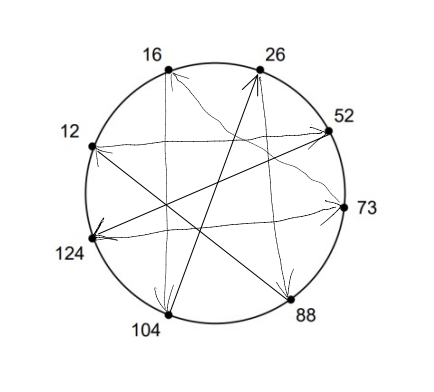

# HW1
<br>

## Question 1
*Question*

The task requires using the dig command to provide answers. To ensure accurate results, it
is recommended to perform these steps from a computer located on a campus network. The
user can refer to the dig documentation to understand how to utilize it.

1. Starting from one of the root servers a–m.root-servers.net, perform an iterative lookup for the host www.eecs.mit.edu. For instance, you can initiate the search by using the following command:
    ```
    dig @h.root-servers.net www.eecs.mit.edu
    ```
    Please provide a list of the following information for each name server you visit during the lookup process:
    - Can you specify the domain name of the name server being visited?
    - Can you provide the IP address of the name server that is currently being used?
    - How long did the query take?
    - What is the round-trip time (RTT) to the server, which can be determined by using the "ping" command to connect to the server?
    - For how long can you store the results in cache?

2. Perform a *recursive* query using `resolver.illinois.edu` of the name
`www.eecs.mit.edu`. Was this query faster or slower than the sum of the iterative steps? Why do you think that is?

3. Perform an iterative reverse-mapping query for the address of `www.eecs.mit.edu` you found in the previous steps, using `dig -x`. List again the information asked in part 1.

4. Can you explain why the DNS protocol tends to utilize UDP rather than TCP, considering what has been previously discussed in this inquiry?


*Answer*: 
1.  - eecs.mit.edu
    - 35.231.163.5
    - 91 msec
    - rtt min/avg/max/mdev = 31.128/37.290/48.335/5.604 ms
    - The same time as RTT, 37.290ms (avg)
2. The recursive query would probably be quicker than completing each iterative step individually because the resolver would take care of everything for you, including issuing the required DNS queries, monitoring referral answers, and returning the final result. This can lead to fewer network round-trips, quicker response times, and a reduction in the amount of work.

3.  - eecs.mit.edu
    - 35.231.163.5
    - 27 msec
    - rtt min/avg/max/mdev = 35.024/49.701/102.223/20.766 ms
    - The same time as RTT, 49.701ms (avg)

4.  Speed: Compared to TCP, UDP is a quicker and easier protocol. UDP is an excellent fit for the DNS use case because DNS inquiries are frequently brief and only call for one request and one response.

    Stateless: Each DNS query is independent of every other query since the protocol is stateless. Because UDP does not require the overhead of establishing and maintaining a connection, it is well suited for stateless protocols like DNS.

    Error handling: The DNS protocol is designed to handle errors at the application layer, rather than relying on the underlying transport protocol to handle them. UDP is an unreliable protocol that does not guarantee delivery, but it provides faster response times and reduces overhead compared to TCP.

    Firewall traversal: UDP is frequently easier to pass through firewalls than TCP, which may make it simpler for DNS queries to reach their intended destination.

 
    

## Question 2
*Question*

Think about spreading a F-bit file among N peers using a client-server structure. Let the
server have an maximum upload capacity µs, and each client c has a download capacity
dc. Let $d_{min} = min_c d_c$ be the minimum download rate. Assume that the server can serve
multiple clients simultaneously and fluidly set the rate for each client, rc, as long as $∀_cr_c ≤ d_c$
and $\sum _cr_c ≤ µ_s$.


1. Suppose that $µ_s/N ≤ d_{min}$. How would you set the rates rc so that the file is fully
distributed to all clients in a minimum time? (i.e., you are minimizing the time that
the slowest client receives the file.) What would the distribution time be?
2. Suppose now that $µs/N > d_{min}$. How would you set the rates rc now to fully distribute
the file to the clients in a minimum time? And what would this time be?
3. Consider a concrete example with 5 clients with $d_c$ = {06, 12, 18, 24, 30} and a server
upload capacity of $µ_s$ = 30. How would you set the rates to get the smallest average
download time without increasing the total distribution time from the previous part?

*Answer*:   
1.  It would be $µ_s/N$. If we set $r_c = µ_s/N$, $∀_cr_c ≤ d_c$ is satisfied because $µ_s/N ≤ dmin$. Also, if we sum up all the $r_c$, we get $µ_s$, $\sum _cr_c ≤ µ_s$ is true. The time is $F/r_c = F * N/ µ_s$
2.  It would be $d_{min}$. The time is $F/d_{min}$
3.  
| time     | dc = 6 |dc = 12| dc = 18|dc = 24|dc = 30|
| ------ | ------- |--------|---------|--------|--------|
| 0~1.25    | rc = 6 | rc = 0 | rc = 0  | rc = 0 | rc = 24|
| 1.25~3.75| rc = 6  | rc = 12| rc = 12 | rc =  0 |rc = 0(finished)| 
| 3.75~5| rc = 6  | rc = 0(finished)| rc = 0(finished) | rc =  24 |rc = 0|
$t_{avg} = 3.75s$
            

    
## Question 3
*Question*

BitTorrent employs a choking mechanism for distributing bandwidth to peers. It selects the
four peers that have provided the best download performance using a tit-for-tat strategy
and one additional peer chosen randomly, referred to as an "optimistic unchoking". The
selection of the four best peers and the random choice are updated every second.

Suppose Bob joins a BitTorrent swarm with 30 other peers. Let each peer, including Bob,
have an upload speed of 80 Mbps and unlimited download speed. Consider what happens in
the phase of the protocol where for each pair of peers A and B, A has some blocks that B
wants and vice versa; i.e, any peer can productively download data from any other peer.

1. If Bob intends to not upload any data and become a free rider, what would his average
download speed be?
2. What would be the average download rate for the remaining peers?
3. Suppose that Bob runs a second client that pretends to be a separate peer, who also
becomes a free rider. How fast can Bob download data now?
4. Suppose Bob switches his two clients to the regular BitTorrent code and they both start
uploading as well. Will Bob’s performance see a noticeable improvement compared to
when he was not contributing?


*Answer*: 

1. Because Bob don't upload files so he can't be the top 4 contributor for other peers, he can only download the file when "optimistic unchoking". For each of 30 peers, Bob has only 1/ (30 -4) possibility to get connected.

    Download Speed = 80 / 5 / 26 * 30 = 18.46 Mbps

2. AvgRate = (80Mbps * 30 - 18.46Mbps) / 30 = 79.38 Mbps
3. Download Speed = 80 / 5 / 27 * 30 * 2 = 35.56 Mbps
4. Yes, he will. Current Avg Speed = 80 Mbps * 2 = 160 Mbps

## Question 4
*Question*

Consider a distributed hash table (DHT) with 8 peers and an 8-bit hash ID that operates in
a circular fashion. The peers are represented by the values {12, 16, 26, 52, 73, 88, 104, 124}.
The key-value pairs are assigned to the peer that immediately follows the key in the circular
DHT.
1. What is hashing ID space?
2. In which peer is the key-value pair stored in the following circumstances:
(a) The key has a value of 19?  
(b) The key has a value of 125?
3. If peer 88 initiates a search for the value associated with key 23, as shown in the
illustration on the left, how many messages will be necessary to complete the query?
This includes the message that initiates the query and the message that returns the
value. Provide an explanation for the answer?
4. Assume each peer is given one cord and is now aware of the next two successors as
shown in the right figure above. If peer 12 starts a query for the value associated
with key 111, then how many messages (including the query message and return value
message) are required to resolve this query? Explain why?
5. What is the maximum number of messages to resolve any query if
3
(a) each peer is aware of its immediate successor as shown in the left figure above?
(b) each peer is given one cord and is now aware of the next two successors?
6. Given that each peer is provided with one cord, can you propose a new arrangement
of the cords that would minimize the maximum number of messages needed to resolve
any query? Draw a representation of the circular distributed hash table and provide
an argument to support why your solution is effective

*Answer*: 
1. Since we have 8 bits, $2^8 = 256$, we get 256 IDs. 
ID space is ${0,1,2,...,255}$, from 0 to 255. 
2.  (a) key value = 19, assigned to peer 26
        
    (b) key value = 125, assigned to peer 12. 
3. 88 is assigned to peer 88. 23 is assigned to peer 26. To get 23, it will  search 104, 124, 12, 16, 26 and get returns value back. Totally 6 messages. 
4. 111 is assigned to 124. The searching steps are 26, 73, 104 then 124. Inclduing returning message, there are 5 messages totally. 
5.  (a) 8 times. 
        
    (b) 5 times.
6.  
  
As it's shown by the figure, each key is assigned to the ones that's symmetric to it and that's how the maximum number of messages is minimized. At most 4 times of search is needed.   
The followings are the reasons. 
For each node, it can access to its successor and cord. The maximum number of search will cover all the nodes to reach the target key. Begin from one node and it can have direct access its successor, there are six nodes left that it cannot access, each node can have access to two other nodes. So searching the left six nodes require at most $6/2 = 3$ times, if everything is optimized. 

## Question 5
*Question*
1. How does a web server handle multiple HTTP connections at the same time, even
though all of the data packets received from different sessions are all directed to its
TCP port 80? In other words, how does the server ensure that each packet is correctly
delivered to its corresponding socket?
2. Is there a restriction on the number of simultaneous connections a single host can make
with a web server, such as "a host can only maintain one HTTP connection with the
server at any given time"? If such limitations exist, please describe them. If not, please
explain the reasons why there are no limitations.


*Answer*: 

1. When a web server receives multiple HTTP connections, it first create a specific process and then assigns a unique socket to each connection, even if all of them are directed to port 80. Each socket is associated with a unique combination of IP address and port number. The server uses this information to route incoming packets to the correct socket. The server keeps track of the state of each connection and associated sockets and uses mechanisms such as threading or asynchronous I/O to manage multiple sockets in parallel. TCP guarantees reliable and ordered delivery of packets, while HTTP uses request and response headers to ensure that packets are properly labeled and that responses are matched to the corresponding requests.

2. No. Because a host can have many applications running on several different ports. All of them can request from the same server. 


## Question 6
*Question*
1. How can the maximum utilization of the network be calculated, when Alice is sending
data to Bob using the stop-and-wait method, given that the bottleneck bandwidth is
40 Mbps and the end-to-end delay is 25 ms, and each packet being sent is 1200 bytes
with 32 bits reserved for the checksum and sequence number?
2. How should Alice and Bob set their timeout value?
3. What changes would you make to the protocols if the connection between Alice and
Bob is ensured to not cause any packet damage?
4. What would be the impact on performance of this change?


*Answer*: 

1. Utilization rate is 
$ U = \frac{\frac{L}{R}}{RTT+L/R} = 4.78 e -3$
2. If timeout value is too small, it will cause unnecessary resending and if it's too big, it will let client to wait for a long time. The total delay is $RTT+L/R = 50.24ms$. It must be greater than 50.24ms. 
3. (1) Set timeout value: if the sender doesn't receive the ACK and wait for a timeout value period, it should resend package. 
(2) Add UDP check sum to detect “errors” in transmitted segment, sender puts checksum value into UDP checksum field, reciever check if computed checksum equals checksum field value. 
4. More time is needed but it's more reliable