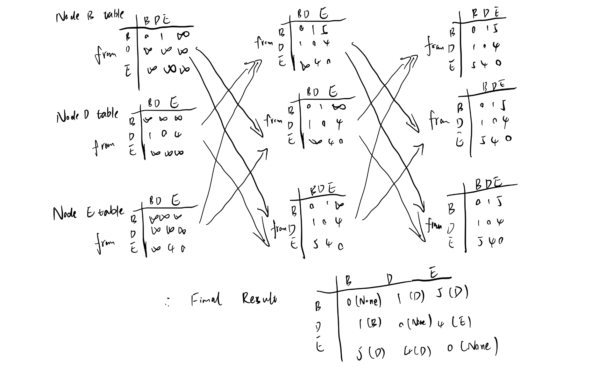

# HW3

## Question 1
### *Answer 1*: 

``` python
r0 = 1
a = 0.7
realrtt = 0.5
finalrtt = r0
for i in range(20):
    finalrtt = a * finalrtt + (1 - a) * realrtt
finalrtt
```
With this python simulation code, we can get the RTT-timeout(20) = 0.5004
    
### *Answer 2*: 

After changing $\alpha = 0.5$, RTT-timeout(20) = 0.5000

After changing $\alpha = 0.95$, RTT-timeout(20) = 0.679242961204271

We can find out when $\alpha$ is bigger, then the convergence is slower, when it is smaller, the convergence is faster, with the assumption that the real rtt never changes.

---
## Question 2
1. 

|Time| FIFO|| Highest Priority || Round Robin ||WFQ ||
|--|--|--|--|--|--|--|--|--|
||Packet|Delay|Packet|Delay|Packet|Delay|Packet|Delay|
|1|1|1|1|1|1|1|1|1|
|2|2|2     |3|1   |2|2  |   4| 1|
|3|3|2     |2|3   |4|2  |    2| 3|
|4|4|3     |5|1   |3|3  |    3| 3|
|5|6|3     |7|2   |6|3  |   6|3|
|6|5|3     |9|1   |5|3  |   9|1|
|7|7|4     |4|6   |7|4  |    7|4|
|8|9|3     |6|6   |8|3  |    10|1|
|9|8|4     |11|1  |11|1 |   5|6|
|10|10|3   |8|5   |9|5  |   12|2|
|11|11|3   |10|4  |10|4 |   8|6|
|12|12|4   |12|4  |12|4 |  11|4|


2. Delay    
    FIFO: 2.9167  
    HP: 2.9167  (low priority: 1.167 high priority: 4.667)
    RR: 2.9167  (class 1: 3.289 class 2: 2.4)
    WFQ: 2.9167 (class 0: 2.25 class 1: 1.75 class 2: 4.75)
3. The average delays for them are the same. 
Class in HP with higher priority will have smaller delay and class in WFQ with higher weight tend to have smaller delay. 
---
## Question 3
### *Answer 1*: 

For subnet A, 128 addresses suffice;

For subnet B, 32 addresses suffice;

For subnet C, 32 addresses suffice; 

So, 

A: **200.20.15.0**0000000/25 = 200.20.15.0/25

B: **200.20.15.100**00000/27 = 200.20.15.128/27

C: **200.20.15.101**00000/27 = 200.20.15.160/27

### *Answer 2*: 

128.174.240.0/20: **128.174.1111**0000.0/20, so $2^{12}$ address in total

128.174.240.128/25: **128.174.240.1**0000000/25, so $2^{7}$ addresses in total

128.174.240.17: 1 address in total

128.174.252.0/22: **128.174.111111**00.0/22, so $2^{10}$ addresses in total

128.174.240.16/29: **128.174.240.00010**000, so $2^3$ addresses in total

128.174.248.0/22: **128.174.111110**00.0/22, so $2^{10}$ addresses in total

### *Answer 3*: 

(a) R2

(b) Interface 1

(c) Interface 2

(d) Interface 3

(e) Interface 4

(f) R3

---
## Question 4
1. (1)Process runing on the host computer join the network and find a server by sending DHCP discover packet.   
(2)The sever reponds with DHCP offer packet.    
(3)Then host sends DHCP request     
(4)Sever send DHCP ACK back.        
Host gets the IP address from sever.  
2. Yes, it's possible. Their private address can be translated to the same IP using NAT.    
3. IPv6 is 128 bits long and will provide larger IP address space. IPv6 can be global dedicated so it can get rid of NAT. 
4. IPv6 can still be converted to IPv4 using tunneling and continue using NAT service. NAT provides security, devices inside local net not explicitly addressable, visible by outside world (a security plus). 


---

## Question 5

### *Answer 1*

Step | N | D(A) | D(B) | D(C) | D(D) | D(F) | D(G)
--- | ---| ---| ---| ---| ---| ---| ---| 
0   | E | INF | INF | 6, E| 4, E|3, E | INF
1   | EF | INF | INF | 6, E | 4, E | | 5, F
2   | EFD| INF | 5, D | 6, E | | | 5, F
3   | EFDB| 17, B| | 6, E| | | 5, F
4   | EFDBG| 17, B | | 6, E| | | 
6   | EFDBGC | 14, C | | | | |
7   | EFDBGCA | | | | | |

### *Answer 2*



### *Answer 3*
**Step 1**

Node B:
_ | B | C | D
--- | --- | --- | ---|
B | 0 | 4 | 1
C | 4 | 0 | 3
D | 1 | 3 | 0

Node C:
_ | B | C | D
--- | --- | --- | ---|
B | 0 | 4 | 1
C | 4 | 0 | 30
D | 1 | 3 | 0


Node D:
_ | B | C | D
--- | --- | --- | ---|
B | 0 | 4 | 1
C | 4 | 0 | 3
D | 1 | 30 | 0

**Step 2**

Node B:
_ | B | C | D
--- | --- | --- | ---|
B | 0 | 9 | 1
C | 4 | 0 | 30
D | 1 | 30 | 0

Node C:
_ | B | C | D
--- | --- | --- | ---|
B | 0 | 4 | 1
C | 4 | 0 | 5
D | 1 | 30 | 0


Node D:
_ | B | C | D
--- | --- | --- | ---|
B | 0 | 4 | 1
C | 4 | 0 | 30
D | 1 | 5 | 0

**Step 3**

Node B:
_ | B | C | D
--- | --- | --- | ---|
B | 0 | 6 | 1
C | 4 | 0 | 5
D | 1 | 5 | 0

Node C:
_ | B | C | D
--- | --- | --- | ---|
B | 0 | 9 | 1
C | 6 | 0 | 5
D | 1 | 5 | 0


Node D:
_ | B | C | D
--- | --- | --- | ---|
B | 0 | 9 | 1
C | 4 | 0 | 5
D | 1 | 5 | 0

**Step 4**

Node B:
_ | B | C | D
--- | --- | --- | ---|
B | 0 | 6 | 1
C | 6 | 0 | 5
D | 1 | 5 | 0

Node C:
_ | B | C | D
--- | --- | --- | ---|
B | 0 | 9 | 1
C | 6 | 0 | 5
D | 1 | 5 | 0


Node D:
_ | B | C | D
--- | --- | --- | ---|
B | 0 | 9 | 1
C | 4 | 0 | 5
D | 1 | 5 | 0

...

**Step N**:

Node B:
_ | B | C | D
--- | --- | --- | ---|
B | 0 | 9 | 1
C | 9 | 0 | 10
D | 1 | 10 | 0


Node D:
_ | B | C | D
--- | --- | --- | ---|
B | 0 | 9 | 1
C | 9 | 0 | 10
D | 1 | 10 | 0


---
## Question 6
1.  
    (a)   
        d->a->c->e    
        d->c->e     
        d->e    
    (b)     
        d->a
2.  
Link State: Each node stores the cost to other edges. The needed space is $O(E)$.   
Distance Vector: Each node stores distance vector to other nodes. Distance vector is $O(V)$, total cost is $O(V^2)$
Path Vector: Advertise paths to different destination network prefixes. 
$O(V^3)$

space complexity: Link State < Distance Vector < Path Vector


